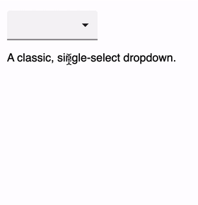
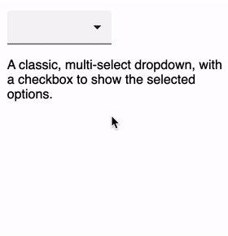
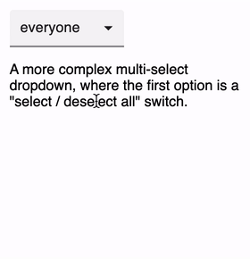
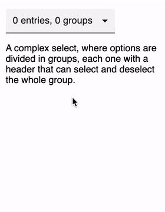
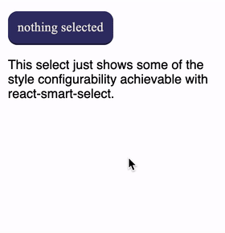
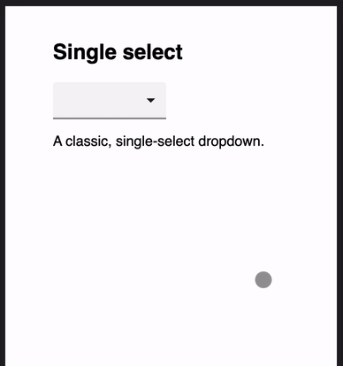

# React Smart Select

A small, responsive and highly configurable React form control. **react-smart-select** allows you to create single-select, multi-select and *toggle-select* controls, where the first item in the list can select and unselect the whole list.

* [Features](#features)
* [Examples](#examples)
* [Installation and usage](#installation-and-usage)
* [Styling](#styling)
* [Props](#props)

## Features

- Single and Multi select modes
- "Toggle" mode
- Responsive
- Custom label and option rendering
- Highly configurable styles
- Beautiful default styles
- Accessible WAI ARIA compliance

## Examples

If you want to run a demo of **react-smart-select** just clone the repository and run `npm run start` or `yarn start` (it will automatically install all the dependencies).

### Single select

A classic, single-select dropdown.



### Multi select

A classic, multi-select dropdown, with checkboxes to show the selected options.



### Toggle select

A more complex multi-select dropdown, where the first option is a "select / deselect all" switch.



### Group select

With little effort it's possible to achieve advanced features like groups of options, where each group has a header that can select and deselect the whole group. You can find the code for this select in the demo app!



### Fancy select

This select just shows some of the style configurability achievable with react-smart-select.



### Responsive layout

On small screens **react-smart-select** switches to a responsive layout.



## Installation and usage

Install the library and its peer dependencies:

`npm install --save-dev react-smart-select styled-components`

or:

`yarn add --dev react-smart-select styled-components`

Example usage:

```jsx
import SmartSelect from 'react-smart-select';
import React from 'react';

const options = [
  { label: 'alice', value: 'alice' },
  { label: 'bob', value: 'bob' },
  { label: 'carol', value: 'carol' },
  { label: 'dave', value: 'dave' }
];

function Form() {
  const [ value, onChange ] = useState();

  return (
    <SmartSelect value={value} options={options}
      onChange={onChange} />
  );
}
```

The `onChange` callback receives three arguments:

```js
  function onChange(value, selected, options) {
    ...
  }
```

* `value`: the current value (for single-mode selects) or the array of currently selected values (for multi-mode and toggle-mode select).
* `selected`: the option the user just clicked.
* `options`: the list of the select's options.

## Styling

There are different ways to customize the appearance of **react-smart-select**.

### Style props

The simplest one is through the usual `style` props, which defines the style of the main component. Styles can also be applied to the various components through additional props:

- `labelStyle`
- `dropdownStyle`
- `optionStyle`

For example:

```jsx
const style = {
  backgroundColor: '#33336a',
  color:           '#efe8de',
  borderRadius:    '12px'
};

const optionStyle = {
  padding: '4px'
};

return (
  <SmartSelect value={value} options={options}
    style={style} optionStyle={optionStyle}
    onChange={onChange} />
);

```

### Stylesheets

Another way to change the component's appearance is through stylesheets. **react-smart-select** define the `.smart-select` class, plus any additional ones you pass with the `className` prop. It also defines other classes on its main elements:

* `.rss-label`
* `.rss-dropdown`
* `.rss-option`

Defining your own styles allows you to style pseudo-elements too, which is not possibile using React's `style` props. For example:

```css
.smart-select {
  font-family: 'Times New Roman', Time, serif;
}

.smart-select .rss-dropdown .rss-option:hover {
  background-color: #dac281;
  color: #efe8de;
}
```

### styled-components

**react-smart-select** uses [styled-components](https://styled-components.com/) for its styles, so you can use its API to wrap it with your own styles.

Remember to declare your wrapped component *outside* any render method, as explained by styled-component's [FAQ](https://styled-components.com/docs/faqs#why-should-i-avoid-declaring-styled-components-in-the-render-method)


```jsx
import SmartSelect from 'react-smart-select';
import styled from 'styled-components';

const Styled = styled(SmartSelect)`
  font-family: 'Times New Roman', Time, serif;

  .rss-dropdown .rss-option:hover {
    background-color: #dac281;
    color: #efe8de;
  }
`;

function StyledComponent() {
  const [ value, onChange ] = useState();

  return (
    <Styled value={value} options={options}
      onChange={onChange} />
  );
}
```

### Callbacks

You can control not only the component style, but its content too. You can pass the `formatLabel` and `formatOptions` callbacks to control what will be printed in each element. These callbacks can return a string or a React component.

The `formatLabel` function is called to format the content of the main select label. It is passed the current value and all the select's options. For single-mode selects, `value` is either the current selected value or `null` if nothing is selected, while for multi-mode selects it's the array of currently selected values or an empty array if nothing is selected.

```js
function formatLabel(value, options) {
  if (value === null) {
    return 'nothing selected';
  }

  return value.label;
}
```

The `formatOptions` function is called to format the content of each option. It is passed the option being rendered and a boolean indicating if it is currently selected or not.

```js
function formatOption(option, selected) {
  if (selected === true) {
    return (
      <strong>{option.label}</strong>
    );
  }

  return option.label;
}
```

## Props

Props you may want to specify include:

- `onChange`: subscribe to change events
- `options`: specify the options the user can select from
- `value`: control the current value
- `className`: optional class name for the component
- `style`: optional style for the component
- `labelStyle`: optional style for the select label
- `dropdownStyle`: optional style for the dropdown box
- `optionStyle`: optional style for each dropdown menu item
- `formatLabel`: a function invoked to get the label content. Can return a string or a React component
- `formatOption`:  a function invoked to get each option content. Can return a string or a React component
- `disabled`: disable the control
- `multi`: enable the multi-select mode
- `toggle`: enable the toggle-select mode.

## Licence

[MIT](LICENSE)
